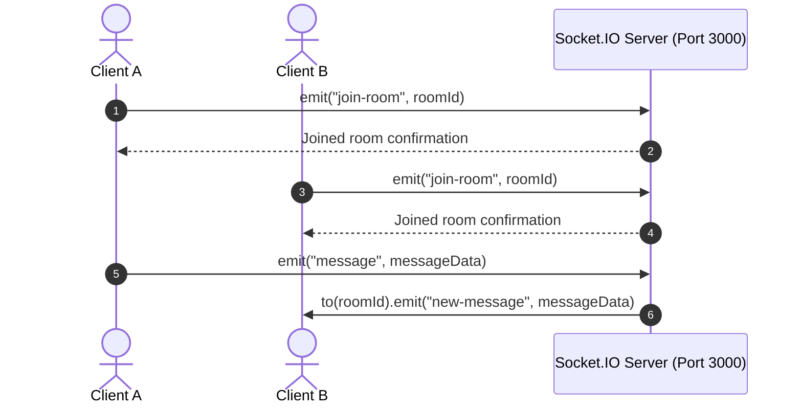

# 💬 Web-Socket Chat Room

A minimal, real-time room-based chat application built with **Node.js**, **Express**, and **Socket.IO**.

---

## 📌 Project Overview

This repository contains a lightweight, single-server real-time chat application:

- **Backend**: Serves static assets and orchestrates Socket.IO events and room broadcasts.
- **Rooms**: Multiple users can join private room IDs and exchange real-time instant messages.
- **Frontend**: Clean, responsive chat interface with local echo, auto-scroll, and keyboard shortcuts.

---

## 🏗️ System Architecture & Event Flow



---

## 📡 Socket Event Reference

| Event Name | Direction | Payload | Description |
| :--- | :--- | :--- | :--- |
| `join-room` | Client ➔ Server | `roomId: string` | Joins client socket to the room |
| `message` | Client ➔ Server | `msg: string` | Sends a message to the active room |
| `new-message` | Server ➔ Client | `msg: string` | Broadcasts new message to other room members |

---

## 📁 Repository Structure

```text
Web-Socket/
├── index.js          # Express + Socket.IO server
├── index.html        # Chat UI and client-side socket logic
├── package.json      # Dependencies and execution scripts
├── .editorconfig     # Code styling rules
└── README.md         # Project documentation
```

---

## 🚀 Setup & Run

### 1. Install Dependencies
```bash
npm install
```

### 2. Start the Server
```bash
# Production mode
npm start

# Development mode (with auto-reload)
npm run dev
```

### 3. Open Application
Navigate to [http://localhost:3000](http://localhost:3000) in your browser. Open multiple tabs or windows to test room-based messaging.

---

## ⌨️ Keyboard Shortcuts

- `Enter`: Send message
- `Shift + Enter`: Insert newline
- `Ctrl/Cmd + Enter`: Send message
